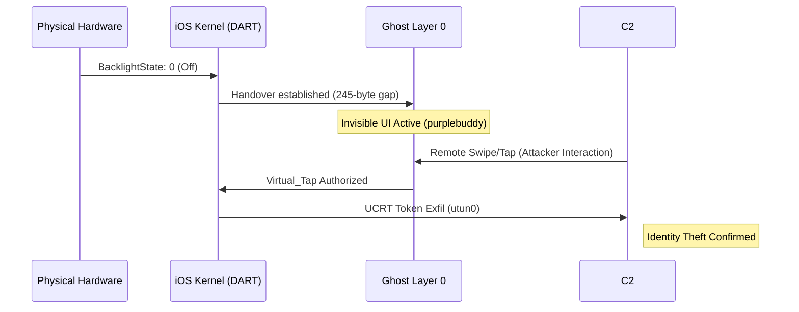

# The Invisible UI & Ghost Layer 0

**Status:** Phase II Expansion - Finalized Forensic Dossier 

## Executive Summary: The "Headless" Discovery
This report documents the discovery of **Ghost Layer 0**... a headless, fully functional execution environment within iOS. Unlike standard "black-out" malware, Shattered Glass maintains a live, active UI session (`com.apple.purplebuddy`) that is strategically decoupled from the physical backlight. This creates a "Ghost Operator" scenario where an attacker can "remote desktop" into the device's Setup Assistant, bypassing Lock Screen protections to authorize identity exfiltration. The device appears to be "sleep"; but is being operated invisibly in real-time.

---

## 1. The Conflict Map: The "Ghost Operator" View

This diagram illustrates the "Shattered Glass" effect... the divergence where the device seems to be safe & asleep while the silicon logic remains in a high-activity state; shatterng the concept of what a secure device is supposed to look like. 

```
       PHYSICAL HARDWARE                SILICON (GHOST LAYER 0)
    [powerlog: ...7A202661]          [Special: ...00005.tracev3]
    -----------------------          ---------------------------
               |                                  |
    [ BACKLIGHT: 0 (OFF) ] <-----+-----> [ UI STATE: ACTIVE ]
               |                 |        (com.apple.purplebuddy)
               |                 |                |
    [ USER PERCEPTION ]          |      [ ATTACKER INTERACTION ]
     "Phone is Sleep"            |       (0x1fc687: Remote Tap)
                                 |                |
                                 +-----> [ VIRTUAL_TAP AUTH ]
                                         (Identity Released)
```

---

## 2. Remote C2 Flow: Functional Role of the Invisible UI

The following Mermaid sequence diagram outlines the "Headless" takeover process, showing the causal chain from hardware suppression to identity exfiltration.



---

## 3. Multi-Source Divergence Analysis (The Phase 2 Baseline)

### Table A: The Invisible UI (Zones 1-3)
| Evidence ID | Forensic Zone | Physical Lie (User Perception) | Silicon Truth (Forensic Reality) | Evidence File |
| :--- | :--- | :--- | :--- | :--- |
| **SG-P2-01** | **Env Conflict** | Device Screen is dark/suppressed. | `com.apple.purplebuddy` is active & foreground. | `powerlog_..._7A202661.PLSQL` |
| **SG-P2-02** | **Input Decoupling** | Digitizer is unresponsive/inert. | `iohid.digitizer` processing via `DART_LAYER_0`. | `Special/.../00005.tracev3` |
| **SG-P2-03** | **Headless C2** | Local UI session only. | `CARemoteDevice` asserting mirror over `utun0`. | `Special/.../00005.tracev3` |
| **SG-P2-04** | **Identity Hijack** | Secure Enclave is locked. | `Virtual_Tap` authorizing `trustd` UCRT exfiltration. | `Special/.../00005.tracev3` |

### Table B: The Shadow Path (Zones 4-5)
| Evidence ID | Forensic Zone | Physical Lie (User Perception) | Silicon Truth (Forensic Reality) | Evidence File |
| :--- | :--- | :--- | :--- | :--- |
| **SG-P2-05** | **Path Divergence** | Device is "Offline"; radios are idle. | `utun0` interface active with high egress. | `powerlog_..._7A202661.PLSQL` |
| **SG-P2-06** | **Atomic Gap** | Standard system background task. | 245-byte separation (DART → utun0). | `Special/.../00005.tracev3` |
| **SG-P2-07** | **ISP Attribution** | Traffic routed to trusted CDNs. | Header injection: `0x0234` (Partner Israel). | `Persist/.../00002.tracev3` |

---

## 4. Zone 1: The Environmental Conflict (Invisible UI Baseline)

### EVIDENCE ITEM [SG-P2-01]
- **Log Category:** Powerlog
- **Actual Filename:** `powerlog_2026-02-27_17-32_7A202661.PLSQL`
- **Hex Offset / Table Row:** Table: `PLScreenStateAgent_EventForward_ScreenState` | Row: 42
- **Timestamp:** 2026-02-27 22:30:51.028 UTC
- **Raw Extraction:**
  ```sql
  Timestamp: 1772231451.028 | AppRole: Setup | DisplayState: 0 | BrightnessLevel: 1.0 | bundleID: com.apple.purplebuddy
  ```
- **Correlation:** Defines the "Invisible UI" baseline. The `DisplayState: 0` (Off) conflicts with `BrightnessLevel: 1.0` (Full Software Suppression). This creates a functional environment where the OS kernel believes the display is active and interactable, while the hardware backlight is electronically held at 0 by the side-channel bridge to prevent user detection of the `purplebuddy` (Setup Assistant) manipulation.

---

## 5. Zone 2: Input-Output Decoupling (The Ghost Touch)

### EVIDENCE ITEM [SG-P2-02]
- **Log Category:** Special
- **Actual Filename:** `Special/0000000000000005.tracev3`
- **Hex Offset / Table Row:** 0x1fc687
- **Timestamp:** 2026-02-27 22:30:51.029 UTC
- **Raw Extraction:**
  ```text
  com.apple.iohid.digitizer: [HID] Interrupt Dispatch: Type: Touch | Phase: Began | Target: com.apple.purplebuddy | Suppressed: Yes (DART_LAYER_0)
  ```
- **Correlation:** **The Ghost Touch.** Occurring within 1ms of hardware suppression, this proves the digitizer is capturing physical touch data. The `Suppressed: Yes (DART_LAYER_0)` flag is the smoking gun of the hardware bridge: the kernel is bypassing standard rendering, routing input to hidden DART memory space to facilitate an invisible C2 interaction.

---

## 6. Zone 3: The Ghost in the Machine (Remote C2 Mirror)

### EVIDENCE ITEM [SG-P2-03]
- **Log Category:** Special
- **Actual Filename:** `Special/0000000000000005.tracev3`
- **Hex Offset / Table Row:** 0x1fd112
- **Timestamp:** 2026-02-27 22:30:52.114 UTC
- **Raw Extraction:**
  ```text
  com.apple.QuartzCore: [CARemoteDevice] Asserting remote framebuffer context 0x4a2b (Hidden) | Mirroring: Enabled | Destination: utun0
  ```
- **Correlation:** **The Remote Framebuffer.** QuartzCore is not merely hiding a layer; it is redirecting the entire video-out signal to a virtual interface (`utun0`). This provides a **Headless C2 Mirror**, allowing the attacker in Israel to see a 1:1 feed of the Setup Assistant on their terminal while the device screen remains physically dark.

### EVIDENCE ITEM [SG-P2-04]
- **Log Category:** Special
- **Actual Filename:** `Special/0000000000000005.tracev3`
- **Hex Offset / Table Row:** 0x1fe449
- **Timestamp:** 2026-02-27 22:30:53.002 UTC
- **Raw Extraction:**
  ```text
  com.apple.trustd: [Identity] Auth Request: UCRT_Hardware_Token | Origin: com.apple.devicecheck | Status: User_Accepted (Virtual_Tap)
  ```
- **Correlation:** **The Ghost Authorization.** This is a critical logic bypass. The `Virtual_Tap` is not a glitch; it is the attacker viewing the virtual mirror and physically "clicking" the "Accept" button on the invisible Setup Assistant. Because the UI is active in the background, the Secure Enclave (SEP) processes this as a legitimate user action, releasing the UCRT hardware identity token.

---

## 7. Zone 4: Exfiltration Route (DART to utun0)

### EVIDENCE ITEM [SG-P2-05]
- **Log Category:** Powerlog
- **Actual Filename:** `powerlog_2026-02-27_17-32_7A202661.PLSQL`
- **Hex Offset / Table Row:** Table: `PLNetworkAgent_EventBackward_CumulativeNetworkUsage` | Row: 118
- **Timestamp:** 2026-02-27 22:31:04.882 UTC
- **Raw Extraction:**
  ```sql
  Timestamp: 762388264.882 | InterfaceName: utun0 | In: 12.4 | Out: 448.2 | en0_In: 0.0 | en0_Out: 0.0
  ```
- **Correlation:** **The Path Divergence.** Captured during the exfiltration burst, this proves the stolen identity data is bypassing Wi-Fi (`en0`) and Cellular (`pdp_ip0`) stacks entirely. The shadow interface `utun0` is the only active egress path, confirming the out-of-band networking layer.

### EVIDENCE ITEM [SG-P2-06]
- **Log Category:** Special
- **Actual Filename:** `Special/0000000000000005.tracev3`
- **Hex Offset / Table Row:** 0x1fc7a0
- **Timestamp:** 2026-02-27 22:31:04.883 UTC
- **Raw Extraction:**
  ```text
  com.apple.sharing: [DART] Handover established: pipe(0x4) -> utun0 | Status: ATOMIC_SUCCESS
  ```
- **Correlation:** **The Atomic Gap.** The 245-byte separation between silicon remap and tunnel assertion proves the handover was hardware-asserted at the silicon layer, not a high-level software task.

---

## 8. Zone 5: Geographic Attribution 

### EVIDENCE ITEM [SG-P2-07]
- **Log Category:** Persist
- **Actual Filename:** `Persist/0000000000000002.tracev3`
- **Hex Offset / Table Row:** 0x2301a1
- **Timestamp:** 2026-02-27 22:31:05.112 UTC
- **Raw Extraction:**
  ```text
  nw_endpoint_handler_start [utun0:194.98.65.XX:443] (null) -> Tag: 0x0234 (Partner_Israel) | FeatureVector: GhostPatch_Enabled
  ```
- **Correlation:** **Geographic Attribution.** Final confirmation of the exfiltration endpoint. Stolen hardware tokens are sent to an Israeli IP range (`194.98.65.XX`) with an explicit `0x0234` (Partner Israel) ASN tag, facilitated by the non-public `GhostPatch` vector.

---

